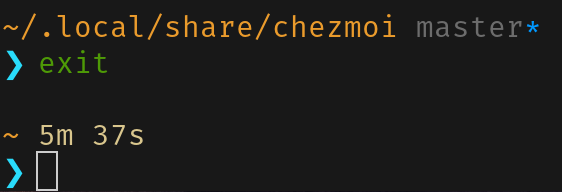

# dotfiles

Dotfiles managed with [chezmoi](https://github.com/twpayne/chezmoi)

> [!CAUTION]
> This is not intended to be used. Despite being a public repository, __this set of configurations is not intended for you__, nor do you likely gain much from using it due to personalized workflow.
>
> Configuration setup is designed for debian-based (since `apt`) systems, **Pop!_Os** specifically.

Apply:

```shell
sh -c "$(curl -fsLS https://chezmoi.io/get)" -- init --apply ironkayman
```

<p align="center">
    </img>
</p>

## Contents

- [dotfiles](#dotfiles)
  - [Contents](#contents)
  - [🌻 Shell](#-shell)
  - [.⚙️ Configurations](#️-configurations)
    - [Tilix](#tilix)
    - [Krita](#krita)
    - [Firefox](#firefox)
    - [Git](#git)
    - [Zed](#zed)
    - [Language Servers](#language-servers)

## 🌻 Shell

*`.zchrc`*

[ZSH](https://wiki.archlinux.org/title/Zsh) shell is configured with [Zinit](https://github.com/zdharma-continuum/zinit) plugin manager and [Pure prompt](https://github.com/sindresorhus/pure) recolor.

Windows prerequisites:

```powershell
Invoke-WebRequest -Uri "https://aka.ms/getwinget" -OutFile "$env:TEMP\Microsoft.WinGet.msixbundle" | Out-Null; Add-AppxPackage -Path "$env:TEMP\Microsoft.WinGet.msixbundle

[System.Environment]::SetEnvironmentVariable("Path", "C:\Program Files (x86)\Microsoft Visual Studio\2022\BuildTools\VC\Tools\Llvm\x64\bin;C:\Program Files (x86)\Microsoft Visual Studio\2022\BuildTools\MSBuild\Current\Bin;C:\Program Files (x86)\Microsoft Visual Studio\2022\BuildTools\VC\Tools\MSVC\14.38.33130\bin\Hostx64\x64;C:\Program Files\Git\bin\;C:\Program Files\Git;C:\Program Files\nodejs\;%UserProfile%\AppData\Local\Microsoft\WindowsApps;C:\Program Files\Python311\;%UserProfile%\.cargo\bin;%UserProfile%\.rustup\toolchains\1.76-x86_64-pc-windows-msvc\bin;C:\Program Files\NASM\", "User")

winget install Task.task
winget install chezmoi
sudo config --enable normal
task --taskfile "$(Get-Location)/.local/share/chezmoi/deploy.windows.yml" deploy
```

## .⚙️ Configurations

Packages and flatpak applications that are installed on script execution are specified at `run_once_install-packages.sh`. Major navigational changes a listed below.

### [Ghostty](https://github.com/ghostty-org/ghostty)

*`~/.config/ghostty`*

Ghostty works as terminal emulator and multiplexer.

| Action        | Shortcut   |
|:-------------:|:----------:|
| Switch panes | Alt Arrows |
| Switch tabs | Alt Ctrl Left/Right |
| Copy selection | Alt c |
| Paste selection | Ctrl/Alt v |
| Create pane | Alt Shift Arrows |
| Create tab | Alt t |
| Close tab/pane | Alt q |

### [Zellij](https://github.com/zellij-org/zellij)

*`~/.config/zellij`*

Zellij partially captures truncated inputs and allows for session detachment.

### [Tilix](https://github.com/gnunn1/tilix/)

| Action        | Shortcut   |
|:-------------:|:----------:|
| Switch panes | Alt Arrows |
| Switch to tab to the Left/Right | Alt Shift Left/Right |
| Copy selection | Ctrl c |
| Paste selection | Ctrl v |

### [Zed](https://github.com/zed-industries/zed)

*`.var/app/dev.zed.Zed/config/zed`*

Zed default keymap, except for:

| Action        | Shortcut   |
|:-------------:|:----------:|
| Workspace::Switch active panes | Alt Arrows |
| Workspace::Switch to tab to the left/right | Alt Shift Left/Right |
| Terminal::Copy selection | Ctrl c |
| Terminal::Paste selection | Ctrl v |

~~As it doesn't die on browseing TB's codebase~~


### [Krita](https://krita.org/en/)

*`.var/app/org.kde.krita/config/private_kritashortcutsrc`*

| Action                  | Shortcut        |
|:------------------------|:---------------:|
| Color pick              | Ctrl LMB        |
| Rotate canvas           | Shift LMB       |
| Zoom canvas             | Shift touch CLW |
| Freehand selection tool | S               |
| Freehand Brush mode     | B               |
| Transform tool          | Ctrl t          |
| Move tool               | t          |
| Deselect                | Ctrl Shift a    |

### Firefox

*`.var/app/org.mozilla.firefox/dot_mozilla/private_firefox/user.js`*

Fine-tined [arkenfox's user.js](https://github.com/arkenfox/user.js) configuration file outside of any profile

### Git

*`.gitconfig`*

Specified [Git Cinnabar](https://github.com/glandium/git-cinnabar) version commit

### Language Servers

| Language | Config |
|:--------:|:------:|
| Zig | `.config/zls.json` |
